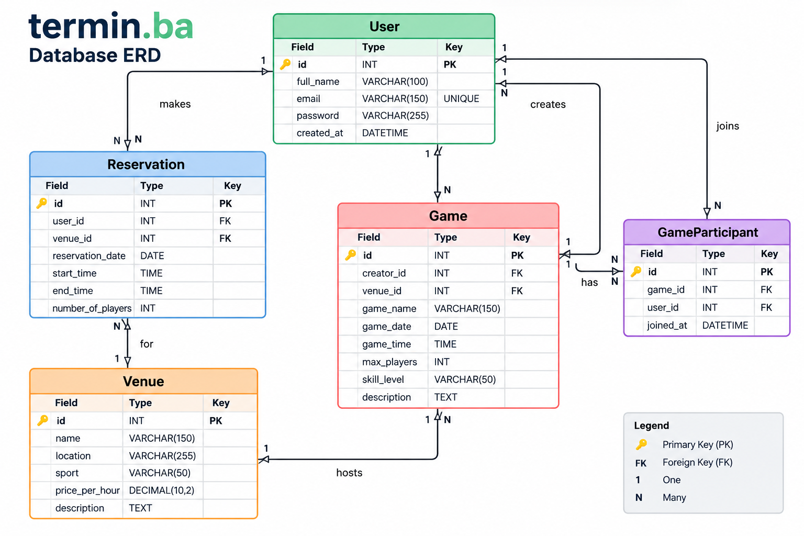

# Termin.ba Database Schema

## 1. User

Stores information about registered users.

| Field | Type | Key | Description |
|---|---|---|---|
| id | INT | PK | Unique user ID |
| full_name | VARCHAR(100) | | User's full name |
| email | VARCHAR(150) | UNIQUE | User's email |
| password | VARCHAR(255) | | User password |
| created_at | DATETIME | | Account creation date |

---

## 2. Venue

Stores information about football fields and sports venues.

| Field | Type | Key | Description |
|---|---|---|---|
| id | INT | PK | Unique venue ID |
| name | VARCHAR(150) | | Venue name |
| location | VARCHAR(255) | | Venue location |
| sport | VARCHAR(50) | | Available sport |
| price_per_hour | DECIMAL(10,2) | | Hourly price |
| description | TEXT | | Venue description |

---

## 3. Game

Stores games created by users.

| Field | Type | Key | Description |
|---|---|---|---|
| id | INT | PK | Unique game ID |
| creator_id | INT | FK | User who created the game |
| venue_id | INT | FK | Venue where the game takes place |
| game_name | VARCHAR(150) | | Name of the game |
| game_date | DATE | | Game date |
| game_time | TIME | | Game time |
| max_players | INT | | Maximum number of players |
| skill_level | VARCHAR(50) | | Required skill level |
| description | TEXT | | Game description |

---

## 4. Reservation

Stores venue time slot reservations.

| Field | Type | Key | Description |
|---|---|---|---|
| id | INT | PK | Unique reservation ID |
| user_id | INT | FK | User who made the reservation |
| venue_id | INT | FK | Reserved venue |
| reservation_date | DATE | | Reservation date |
| start_time | TIME | | Reservation start time |
| end_time | TIME | | Reservation end time |
| number_of_players | INT | | Number of players |

---

## 5. GameParticipant

Connects users with games they have joined.

| Field | Type | Key | Description |
|---|---|---|---|
| id | INT | PK | Unique participant record ID |
| game_id | INT | FK | Joined game |
| user_id | INT | FK | Participating user |
| joined_at | DATETIME | | Date and time the user joined |

---

# Relationships

- One **User** can create many **Games**.
- One **Venue** can host many **Games**.
- One **User** can make many **Reservations**.
- One **Venue** can have many **Reservations**.
- One **User** can join many **Games**.
- One **Game** can have many **Users** through **GameParticipant**.

## Relationship Summary

```text
User 1 ──────── N Game
Venue 1 ─────── N Game

User 1 ──────── N Reservation
Venue 1 ─────── N Reservation

User 1 ──────── N GameParticipant
Game 1 ──────── N GameParticipant

## Entity Relationship Diagram

